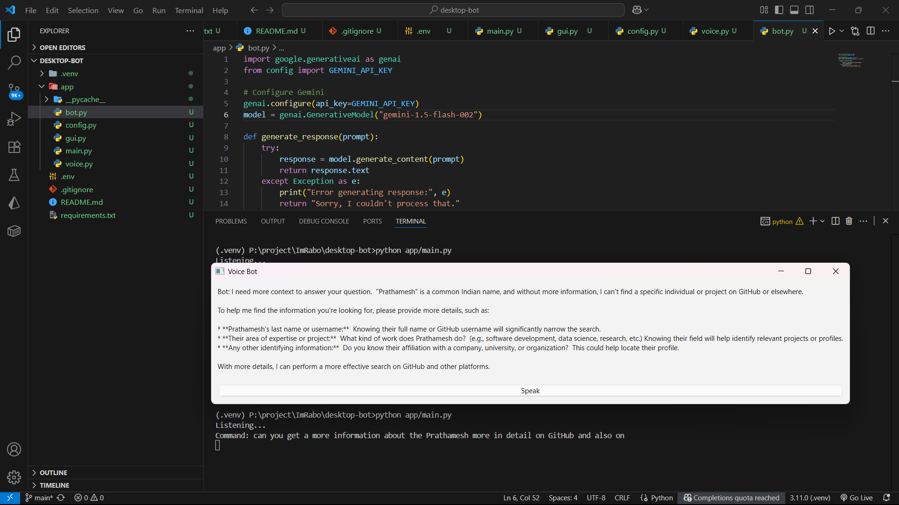

# Desktop Voice Bot

A Python desktop bot that supports **voice recognition, text-to-speech, and GUI interaction**.  
This bot can listen to commands, process them, and respond with speech.  

  

---

## Features

- Voice recognition using `SpeechRecognition`
- Text-to-speech responses
- GUI interface for easy interaction
- Modular architecture:
  - `bot.py` → core bot logic
  - `voice.py` → microphone and speech functions
  - `gui.py` → GUI interface
  - `config.py` → project settings
  - `main.py` → application entry point
- Environment variables support via `.env`
- Easily extendable for new commands or integrations

---

## Project Structure

```

.
├── .env                 # Environment variables (API keys, configs)
├── .gitignore           # Files/folders to ignore in git
├── README.md            # Project documentation
├── requirements.txt     # Python dependencies
├── app/
│   ├── bot.py           # Core bot logic
│   ├── config.py        # Configurations and constants
│   ├── gui.py           # GUI logic
│   ├── main.py          # Entry point
│   └── voice.py         # Voice recognition / speech functions

````

---

## Installation

1. Clone the repository:

```bash
git clone https://github.com/iamprathameshmore/desktop-robo
cd desktop-robo
````

2. Create a virtual environment:

```bash
python -m venv .venv
# Activate environment
# Windows
.venv\Scripts\activate
# Linux/Mac
source .venv/bin/activate
```

3. Install dependencies:

```bash
pip install -r requirements.txt
```

4. Create a `.env` file for your configuration:

```env
API_KEY=your_api_key_here
```

---

## Usage

Run the bot:

```bash
python app/main.py
```

The GUI will launch, and the bot will start listening for voice commands.

---

## Contributing

1. Fork the repository
2. Create a new branch (`git checkout -b feature/my-feature`)
3. Commit your changes (`git commit -am 'Add new feature'`)
4. Push to the branch (`git push origin feature/my-feature`)
5. Open a Pull Request

---

## License

This project is licensed under the MIT License.


